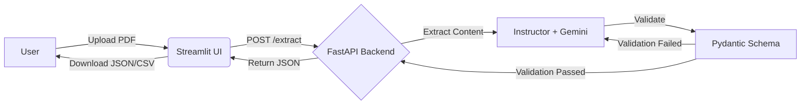

# Automated Invoice & Resume Extractor


An AI-powered extraction pipeline that seamlessly converts unstructured documents (PDF/Text) into structured JSON data using Google Gemini and Instructor.

## Features
- **Dynamic Pydantic Schemas**: Extracts Invoices and Resumes into strict, strongly-typed JSON formats.
- **Robust Auto-Correction**: Uses `instructor`'s validation loop (`max_retries=3`) to ensure 100% schema compliance.
- **Side-by-Side UI**: View your raw PDF next to the extracted JSON and Tables in Streamlit.
- **Export Options**: Download extracted data as JSON or tabular CSV.
- **Auto-generated API Docs**: Swagger UI available at `/docs` out of the box via FastAPI.

## Architecture



## Local Setup

### 1. Prerequisites
- Docker and Docker Compose
- Google Gemini API Key

### 2. Environment Variables
Create a `.env` file in the root directory (you can copy `.env.example`):
```bash
GEMINI_API_KEY=your_gemini_api_key_here
```

### 3. Run with Docker Compose
```bash
docker-compose up --build
```
- **Frontend UI**: [http://localhost:8501](http://localhost:8501)
- **Backend API Docs**: [http://localhost:8000/docs](http://localhost:8000/docs)

## Deployment (Render.com / Hugging Face Spaces)
1. Fork this repository.
2. Link the repository to your hosting provider.
3. For the Backend, point the build command to `Dockerfile.backend`.
4. For the Frontend, point the build command to `Dockerfile.frontend` and set the `API_URL` environment variable to your deployed backend URL.
